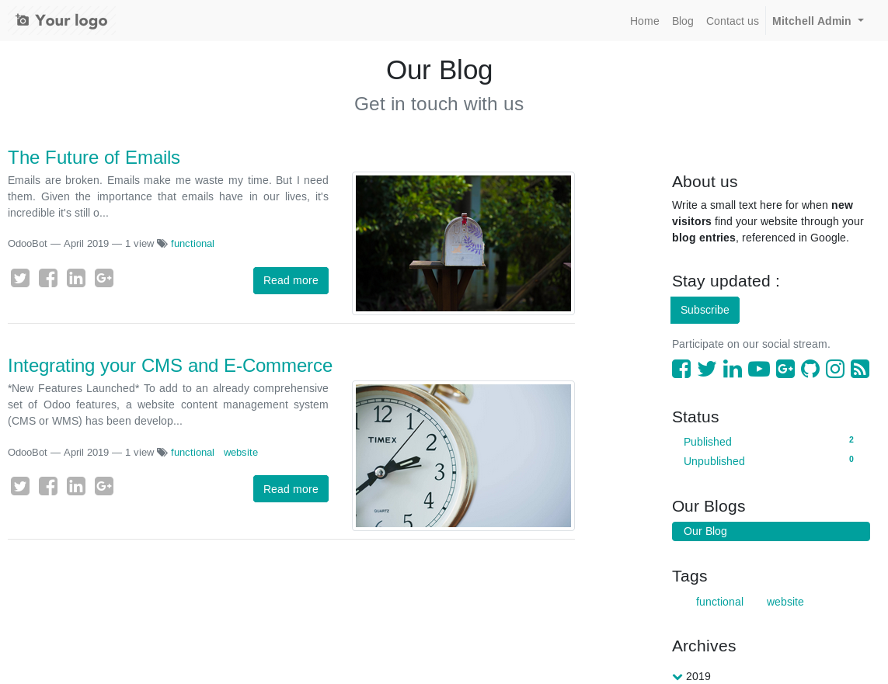

This module extends the functionality of blogs to support having a more
attractive layout that automatically displays an excerpt of each post, a "Read
more" button and the chosen social share image (which will default to the 1st
one in the post content if there's no cover).

It looks like this:

