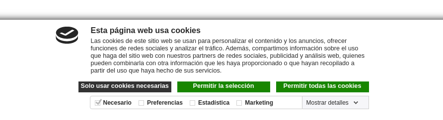

To use this module, once configured for your website, you just need to browse
that website. You will see the Cookiebot consent banner, and a *Cookies Policy*
link in the footer.

Remember that, if your browser is configured to block 3rd party cookies,
trackers or consent banners, you won't notice the change. Disable any of those
protections to experiment the benefits.
