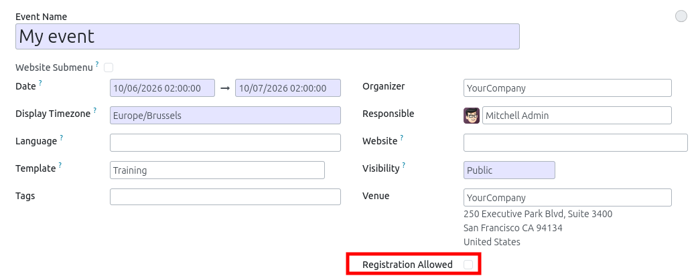
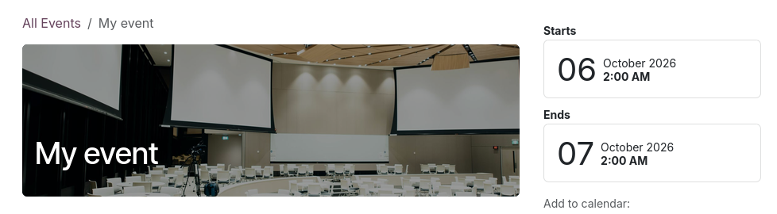

This module extends the ``website_event`` Odoo module to provide an extra option
on the model ``event.event``, to disable registrations.
Such features is interesting if we want to display on the websites, event organized
by third parties. In that case, registrations are managed in other websites.

As a result, the button to register is hidden in the website event form view.

