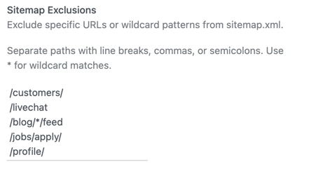
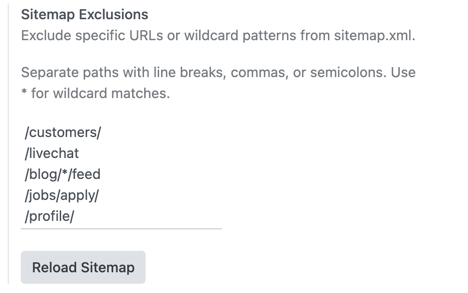

Sitemap exclusions:

1. Create or publish website pages as usual.
2. Configure the paths or patterns to exclude in **Website > Configuration >
   Settings > Sitemap Exclusions**.

   

3. Open `/sitemap.xml`.
4. Confirm that excluded URLs are absent and non-excluded public pages are still
   present.

Example:

- configure `/customers/`;
- publish a page at `/customers`;
- publish another page at `/customers/other`;
- open `/sitemap.xml`.

The `/customers` URL is excluded. The `/customers/other` URL remains visible
because `/customers/` is an exact path, not a wildcard pattern.

For wildcard matching:

- configure `/blog/*/feed`;
- publish or expose `/blog/other/feed`;
- publish or expose `/blog/feed/other`;
- open `/sitemap.xml`.

The `/blog/other/feed` URL is excluded. The `/blog/feed/other` URL remains
visible because it does not match the configured pattern.

Ways to update the sitemap.xml:
1. The sitemap cache is automatically cleared when website pages are created,
   deleted, or their URL changes.

2. The manual **Reload Sitemap** button can be used when a forced sitemap cache clear is
   needed.

   
