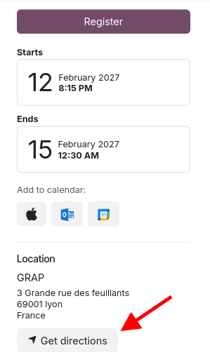

By default, in Odoo when website module displays directions,
it provides an Google Map URL.

With that module, it provides an OpenStreetMap URL.

Also if the related partner has longitude and latitude defined, it used it,
instead of a approximative search URL. 

