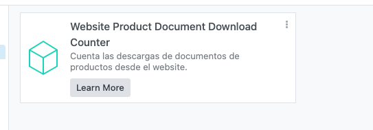
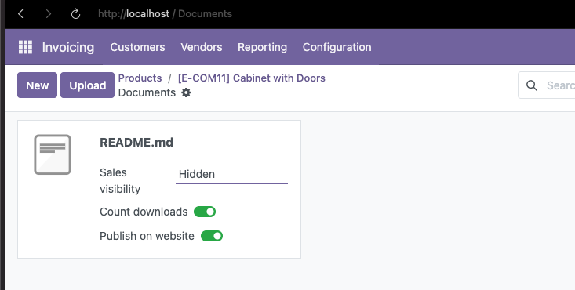
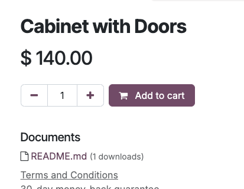

## Usage

1.  Install the module from the Odoo interface.

2.  Upload documents to products from the backend.

3. When a user downloads a document from the website, the download
    counter will automatically increment.

4.  View download statistics in the product view.
