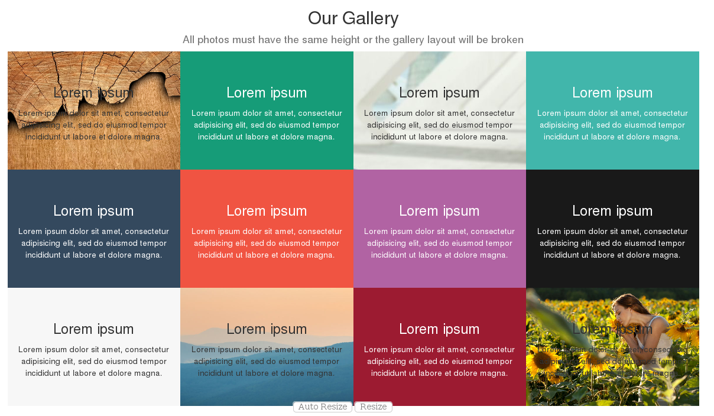

.. image:: https://img.shields.io/badge/licence-LGPL--3-blue.svg
    :alt: License: LGPL-3

==========================
Marginless Gallery Snippet
==========================

This module extends the functionality of the website module to add a new
snippet that forms a marginless gallery and allow you to create a grid of
photos that have no spaces between themselves.

Usage
=====

To use this module, you need to:

* Edit any page in your website.
* Go to **Insert blocks > Features**.
* Drag the **Marginless Gallery** snippet anywhere in your page.

To change images, you need to:

* Select any image block in the snippet you just created.
* Go to **Customize > Background** and choose any background you want.

  * Backgrounds will be centered and cover the whole element in any layout.

Bug Tracker
===========

Bugs are tracked on `GitHub Issues <https://github.com/OCA/website/issues>`_.
In case of trouble, please check there if your issue has already been reported.
If you spotted it first, help us smashing it by providing a detailed and
welcomed feedback `here
<https://github.com/OCA/website/issues/new?body=module:%20website_snippet_marginless_gallery%0Aversion:%208.0.1.0.0%0A%0A**Steps%20to%20reproduce**%0A-%20...%0A%0A**Current%20behavior**%0A%0A**Expected%20behavior**>`_.

Credits
=======

Contributors
------------

* `Tecnativa <https://www.tecnativa.com>`__:

  * Jairo Llopis
  * Cristina Martin R.

Maintainer
----------

.. image:: https://odoo-community.org/logo.png
   :alt: Odoo Community Association
   :target: https://odoo-community.org

This module is maintained by the OCA.

OCA, or the Odoo Community Association, is a nonprofit organization whose
mission is to support the collaborative development of Odoo features and
promote its widespread use.

To contribute to this module, please visit https://odoo-community.org.
