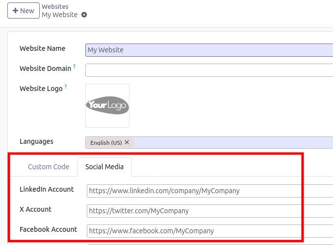

This module is a bugfix.
In odoo, when creating a new website, the URLs of the social
media are copied from `res.company` model to `website` model.
Once done, it is not possible to user to change data
on `website` model, if an URL change, or a new social media
is used.

This module adds Social Medial links on websites back-end
form view.

